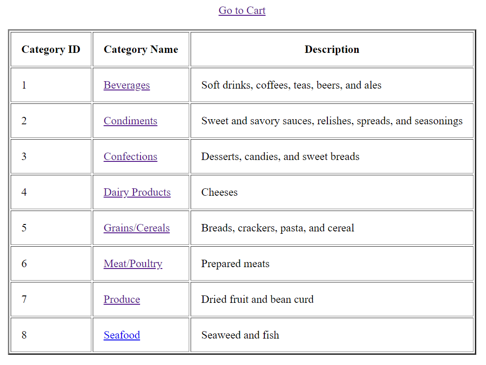
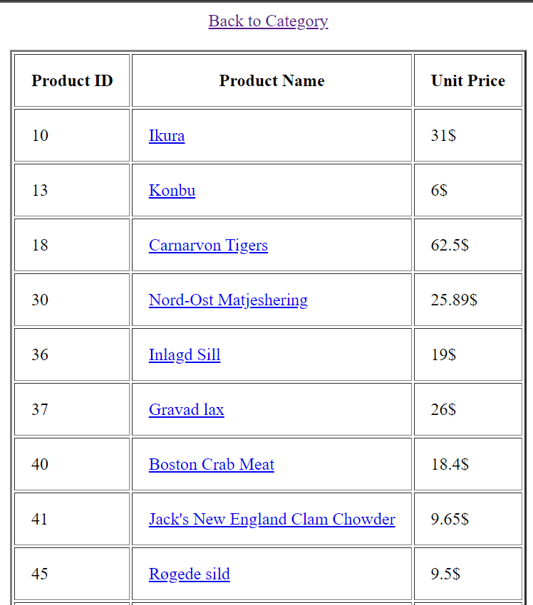
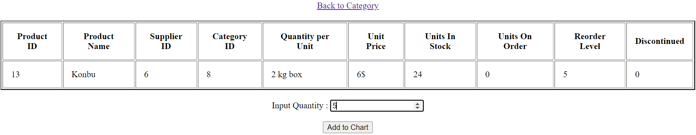
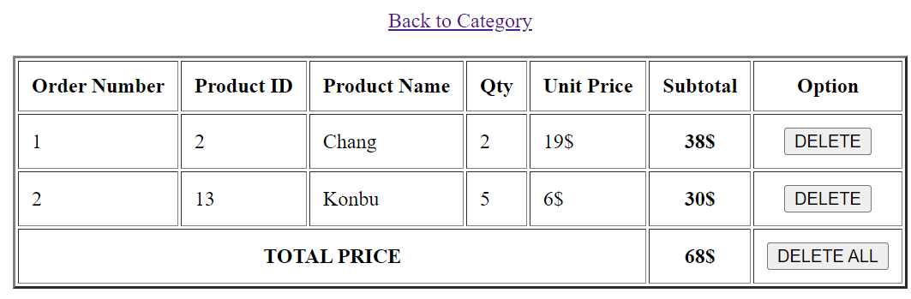

# php-simple-cart

## About the Project

**php-simple-cart** is a PHP-based web application designed to facilitate online shopping by displaying data lists for categories, products, product details, and shopping cart interactions. It is built using PHP and HTML.

**Learning PHP Sessions**, This project also serves as a learning experience for using PHP sessions to manage user interactions and data persistence across multiple pages.

## Main Features

### Category Management
- View the list of product categories.

### Product Management
- Browse the list of products depends on the categories.

### Product Detail View
- View detailed information about each product, including descriptions, prices, and availability.
- Add products to the cart and adjust quantities

### Shopping Cart
- Display the cart list
- Delete option to remove some or all products in the cart

## Access Requirements

### Web Server Setup
- **Apache Web Server**: Ensure Apache is installed and running on your local machine or server.
   
### Database Setup
- **SQL Database**: Set up a MySQL database to get data (import nwind.sql).

## Documentation

Below are several screenshots from the program:

#### Category Management

#### Product Listing

#### Product Details

#### Shopping Cart

